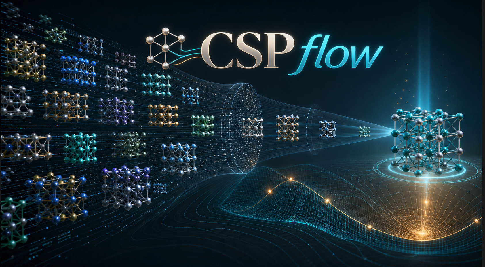

# cspflow

End-to-end high-throughput crystal structure prediction and first-principles
discovery. Give it a chemical space, a list of compositions, or a folder of
structures; it generates candidates, screens them with an MLIP, places them on a
convex hull, runs the survivors through VASP, and reports what came out.

```
source ──► generate ──► screen ──► dedup ──► reference ──► calibrate ──► filter ──► dft ──► analyze
└─────────────── Phase A: cheap, run to completion ────────────────┘     └ Phase B: expensive, streamed ┘
```

Everything lives in one SQLite file per campaign, so a run can be stopped,
inspected and resumed at any point. Cheap MLIP screening runs as a barrier;
expensive DFT runs as a throttled stream under a core-hour budget.

**📖 [User guide](docs/) · [Quick start](docs/quickstart.md) · [Examples](examples/)**

## Install

```bash
pip install "cspflow[full]"
export MP_API_KEY=...            # reference energies come from Materials Project
csp doctor --fix                 # check the cluster; --fix builds the POTCAR layout
```

Structure generation and MLIP screening need MatterGen and MatterSim, which pin
each other and pin torch. `./scripts/build_env.sh cspflow` builds one conda
environment holding all three. Full detail: [Installation](docs/installation.md).

## Run a campaign

A campaign is a **folder**, and every knob you might turn is in it:

```bash
csp init my-campaign -m orion
cd my-campaign
```

```
my-campaign/
├── campaign.yaml   what to search, and how hard   ← every tunable key, listed
├── machine.yaml    partitions, walltime, modules, VASP, POTCAR trees
├── recipe.yaml     the DFT ladder: INCAR tags, k-points, per-step resources
├── inputs/         your own structures or composition lists
├── results/        → workdir on scratch (symlinked on the first run)
└── report/         report.html + candidates.csv
```

```bash
$EDITOR campaign.yaml                   # elements, cutoffs, how many structures
csp doctor                              # then fix whatever it flags

csp source --dry-run                    # what would be enumerated, nothing written
csp run --through calibrate             # Phase A: generate, screen, dedup, calibrate
csp run --from filter --watch           # Phase B: stream DFT under the budget

csp status                              # progress
csp status --why 1042                   # the full life history of one structure
csp report                              # report/report.html + candidates.csv
```

Commands find `campaign.yaml` by walking up from wherever you are, so they work
from any folder inside the campaign. Any stage slice works: `--only screen`,
`--from dft`, `--through dedup`.

In `campaign.yaml` the live keys are the ones you must choose; **every other key
is there too, commented out**, showing the default already in effect and
indented where it belongs — deleting the leading `# ` is the whole edit.

```bash
csp config show --origins               # every resolved value, and which file set it
csp recipe                              # this campaign's DFT ladder, fully resolved
csp run --set filter.e_above_hull_max=0.05    # change one thing without an edit
```

## Three ways in

Complete, runnable versions of all three are in [`examples/`](examples/) — every
block populated and commented, with a sample CSV and real seed structures.

**A chemical space sweep** — every system the groups allow:

```yaml
source:
  - mode: chemical_space
    chemical_space:
      groups:
        A: {elements: [Sm, Tb],                pick: 1}
        B: {elements: [Fe, Co, Ni],            pick: 1, min_fraction: 0.75}
        C: {elements: [Ti, V, Cr, Mn, Cu, Zn], pick: 1}
      max_atoms_formula: 20
```

**An explicit list of compositions** — same funnel, no enumeration:

```yaml
source:
  - mode: composition_list
    composition_list:
      items: [{formula: Sm2Fe17}, {formula: SmFe11Ti, z: [1, 2]}]
      from_file: inputs/compositions.csv   # formula[,z_min,z_max,n_structures]
```

**Structures you already have** — no generation at all; POSCARs and CIFs go
straight to MLIP relaxation and DFT:

```yaml
source:
  - mode: structure_list
    structure_list:
      paths: [inputs/seeds]
      relax: true
      dedup: warn        # 'warn', not 'drop': a curated list is not a duplicate pool
```

Several sources can run in one campaign — give each a `name` and a seed set
stays distinguishable from the sweep it is a control for.
[More →](docs/sources.md)

## Documentation

| | |
|---|---|
| [Installation](docs/installation.md) | Install, the MP key, POTCARs, the ML environment |
| [Quick start](docs/quickstart.md) | Nothing to `report.html` in ten minutes |
| [Choosing your input](docs/sources.md) | The three source modes in depth, and the CSV format |
| [`campaign.yaml` reference](docs/campaign.md) | Every setting, its default, and which ones matter |
| [Running on your cluster](docs/machines.md) | Partitions, modules, walltime, POTCAR trees, VASP |
| [The DFT recipe](docs/recipes.md) | INCAR tags, k-points, resources, the retry ladder |
| [The stages](docs/stages.md) | What each stage does, and why the run has two phases |
| [Reading the results](docs/results.md) | `report.html`, `candidates.csv`, the database |
| [Command reference](docs/cli.md) | Every `csp` command and option |
| [Troubleshooting](docs/troubleshooting.md) | The errors you will actually hit |
| [`examples/`](examples/) | Three complete campaigns with sample inputs |

## Design principles

Three, and they explain most of what looks unusual:

**Nothing implicit.** No `MPRelaxSet`, no library defaults left to inherit. A
recipe that omits `ENCUT` is refused, because VASP would use `max(ENMAX)` over
the POTCARs — which *changes with composition*, so a hull built on it compares
incomparable numbers. `csp recipe` prints every tag literal.

**Stop rather than guess.** An undefined `$VAR`, a typo'd key, an ambiguous
formula, a POSCAR two parsers disagree about: all hard errors. Each is a case
where continuing produces a wrong number that looks exactly like a right one.

**Prove the cheap number before spending on the expensive one.** `calibrate`
runs your own DFT on a sample and checks that the MLIP ranks structures the way
it does. By default it *blocks* Phase B if it does not.

## Status

M0–M4 complete: all nine stages implemented, the unit suite green, and one
end-to-end run on a live cluster.

**One gate is open before a new campaign's DFT hull can be trusted.**
`reference.mode` defaults to `recompute` and is wired to nothing, so a DFT hull
places candidates against Materials Project reference energies — two absolute
scales, measured **~0.19 eV/atom** apart in Fe-Sm-Ti against a **0.06 eV/atom**
selection threshold. `analyze` warns when a hull mixes scales, and Phase A gates
on the MLIP hull, which is unaffected.

## License

MIT.
